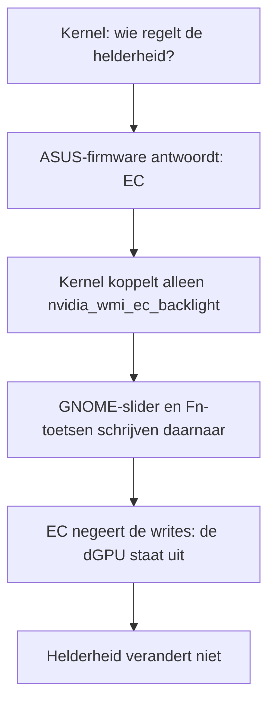
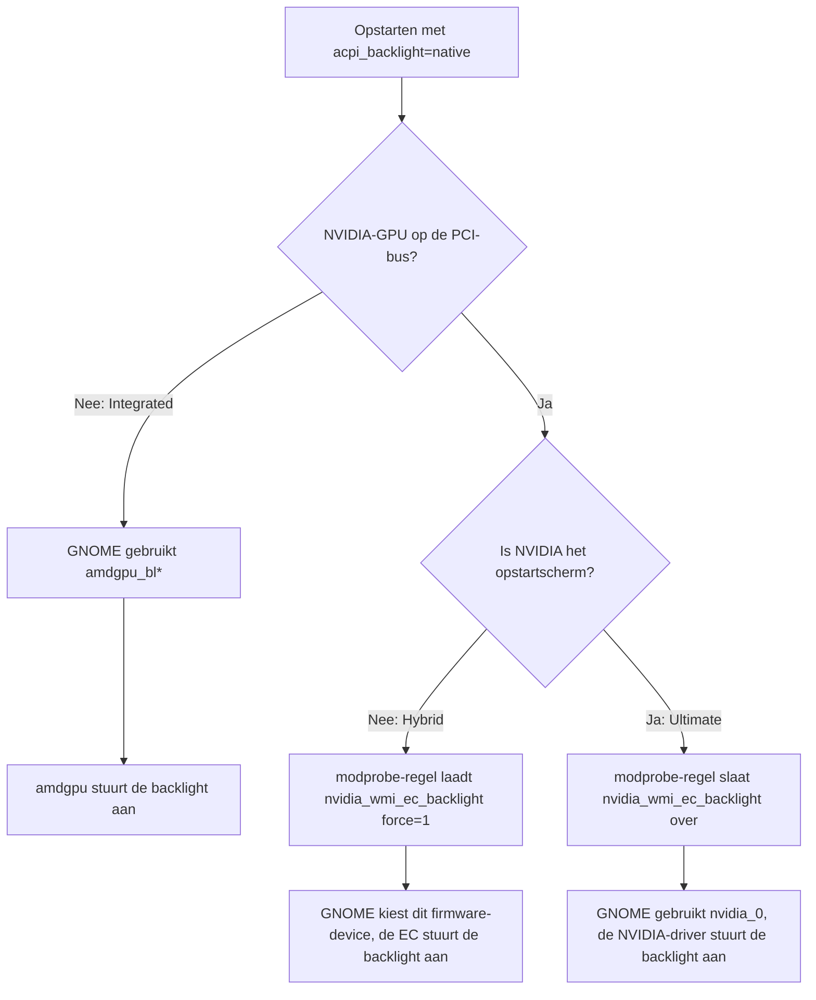

Centrale referentie voor hardware- en softwareproblemen op de ASUS ROG Zephyrus G16 GA605WV. Actieve problemen staan bovenaan. Opgeloste problemen staan onderaan als naslagwerk.

Het meeste hier gaat over de hardware en geldt op welke distributie je ook draait. Waar een oplossing verschilt, heeft het item een CachyOS- en een Bazzite-tab.

## Actieve Problemen

> Dit zijn problemen waar ik persoonlijk nog steeds tegenaan loop. In sommige gevallen is het mogelijk een echte bug; in andere gevallen doe ik misschien zelf iets fout of heb ik iets over het hoofd gezien. Ik deel wat ik heb waargenomen, niet wat ik definitief heb vastgesteld.

{}

**Wat er gebeurt:**
Op v0.9.0 raakte WinBoat regelmatig verstrikt in een eindeloze opstartronde. De Podman-container bleef proberen op te starten maar slaagde daar nooit in, ook niet na eindeloos wachten. De UI toonde "WinBoat Guest API - Offline" en "Container - Exited". Het was niet beperkt tot de eerste installatie; het trad ook op bij latere starts.

**Workaround:**
WinBoat resetten en de initiële configuratie opnieuw doorlopen zorgt dat het weer werkt. Geen duurzame oplossing.

**Status:**
Flink verbeterd op v0.9.2, dat de onderliggende `dockur/windows`-image van 5.14 naar 6.05 tilt. Nog af en toe gezien, dus bijgehouden als [#106](https://github.com/THectic-NL/Zephyrus-Linux/issues/106). Zie de [WinBoat-pagina]() voor meer context.

{}

{}

**Wat er gebeurt:**
Als WinBoat wel opstart en je opent een Windows-app zoals Word, dan kruipt het venster langzaam naar rechts en wordt het steeds kleiner totdat het praktisch weg is. Herstarten helpt niet structureel.

**Workaround:**
Geen gevonden.

**Status:**
Open, bijgehouden als [#107](https://github.com/THectic-NL/Zephyrus-Linux/issues/107). Beta-beperking.

{}

{}

**Wat er gebeurt:**
Het inschrijven van de YubiKey als FIDO2 LUKS-ontgrendelsleutel lukt, maar bij het opstarten geeft `systemd-cryptsetup` `FIDO_ERR_RX` terug. De key is fysiek aanwezig maar lijkt nog niet geïnitialiseerd te zijn door de USB HID-stack op het moment van de query. Dit lijkt met name op te treden bij warme reboots.

Geprobeerd met `token-timeout=30` in crypttab en `rd.udev.settle-timeout=10` als kernelparameter, beide op systemd 259. Geen van beide hielp.

**Status:**
Nog steeds onopgelost, bijgehouden als [#108](https://github.com/THectic-NL/Zephyrus-Linux/issues/108). Onduidelijk of dit een echt hardware/firmware timingprobleem is, iets specifiek voor dit apparaat, of een configuratiefout van mijn kant. Mogelijk later nog een keer opgepakt. Voorlopig gebruik ik de YubiKey voor `sudo` en de GNOME-schermvergrendeling.

Zie de sectie **Dingen die ik graag werkend had gezien** onderaan deze pagina voor de volledige context.

{}

## Opgeloste Problemen

De volgende problemen zijn opgelost. Sommige zijn verholpen door kernel- of driver-updates, andere via een configuratiewijziging, en eerlijk gezegd heb ik een aantal dingen misschien gewoon zelf fout gedaan. Ik heb ze hier toch bewaard, want misschien bespaar ik iemand anders dezelfde zoektocht.

## GPU & Beeldscherm

{}

**Wat er gebeurde:**
Schermhelderheid reageerde nergens op zolang alleen de AMD Radeon 890M iGPU actief was. Niet op de Fn-toetsen, niet op de OS-slider.

**Oorzaak:**
Zonder `acpi_backlight=`-parameter kiest de kernel per boot één backlight-interface (`drivers/acpi/video_detect.c`). Eerst vraagt hij de firmware, via NVIDIA's WMI-backlight-interface (GUID `603E9613-EF25-4338-A3D0-C46177516DB7`), of de helderheid door de embedded controller geregeld wordt. Is het antwoord "EC", dan gebruikt hij `nvidia_wmi_ec_backlight`, en registreren de GPU-drivers geen eigen backlight-devices.

Op een standaardinstallatie in Integrated mode is `nvidia_wmi_ec_backlight` het enige device onder `/sys/class/backlight/`. Die driver registreert alleen als deze check "EC" antwoordt, en de kernel heeft geen quirk voor dit model, dus de firmware moet ook in Integrated mode "EC" antwoorden (afgeleid uit welke driver registreert, nog niet bevestigd door de ACPI-tabellen uit te lezen). Daar klopt dat antwoord niet: de dGPU is helemaal van de PCI-bus verdwenen, de EC negeert de brightness-writes, en de iGPU die het paneel echt aanstuurt krijgt nooit een backlight-device.



De kernelcode zelf is dus niet de boosdoener. Die vraagt het de firmware en vertrouwt het antwoord, zoals bedoeld. De bug zit in de ASUS-firmware.

**Fix:**
Voeg één parameter toe aan `GRUB_CMDLINE_LINUX_DEFAULT` in `/etc/default/grub`, regenereer GRUB en herstart:

```bash
sudo nano /etc/default/grub
# achteraan GRUB_CMDLINE_LINUX_DEFAULT toevoegen: acpi_backlight=native
# andere hardware of kernels: verandert de helderheid nog steeds niet, voeg dan ook amdgpu.backlight=0 toe
sudo grub-mkconfig -o /boot/grub/grub.cfg
sudo reboot
```

`acpi_backlight=native` slaat de firmware-check over en laat de GPU-drivers hun eigen backlight-devices registreren. Meer heeft Integrated mode niet nodig.

**⚠️ In je eentje breekt dit Hybrid mode.** `acpi_backlight=native` schakelt ook `nvidia_wmi_ec_backlight` uit, en die heeft Hybrid mode nodig. Voeg daarom ook de modprobe-regel toe uit het volgende probleem, "Helderheid fixen in Integrated mode brak het in Hybrid mode". Het script `zephyrus-backlight.py` daar voert beide onderdelen in één keer uit.

Dit is een lokale workaround, geen upstream-fix. Zolang ASUS geen firmware-update uitbrengt, is de gebruikelijke plek om dit voor iedereen op te lossen een modelspecifieke quirk in diezelfde detectiecode van de kernel, bijvoorbeeld een die het "EC"-antwoord van de firmware niet vertrouwt zolang de NVIDIA-dGPU niet op de PCI-bus zit.

**Bevestigd werkend:**
- CachyOS (kernel 7.2.5-1-cachyos), alleen `acpi_backlight=native`, opgestart in Integrated mode. `/sys/class/backlight/` toont één `amdgpu_bl*`-device, en de helderheid reageert op de Fn-toetsen en de GNOME quick-settings slider.

Het nummer achter `amdgpu_bl` volgt het DRM-kaartnummer en ligt niet vast: tijdens het testen was het `1` in Integrated mode en `2` in Hybrid mode, maar na een reboot kan het anders zijn. Niets in deze fix hangt ervan af.

**Bevestigd kapot (vóór de fix):**
- Bazzite (Fedora 44, kernel 7.2.4), na het wisselen naar Integrated GPU-mode via ROG Control Center
- CachyOS (kernel 7.2.3-1-cachyos), op een verse installatie zonder `asusctl`. Het systeem staat standaard op iGPU-only, en de helderheid was daar al kapot
- CachyOS, na een volledige handmatige NVIDIA-teardown vóór de modewissel (zie hieronder): de modewissel werd toegepast (`nvidia-smi` faalde zoals verwacht), maar de helderheid reageerde nog steeds niet

**Wat al wél werkte, zelfs vóór de fix:** terugschakelen naar Hybrid (`dgpu_disable` 1→0) herstelde de helderheid live, zonder herstart. Dat past bij de oorzaak: zodra de dGPU weer stroom heeft, werkt het pad via de EC.

**Onderweg uitgesloten:**
- Kernelparameters `nvidia.NVreg_EnableBacklightHandler=0` en `nvidia.NVreg_RegistryDwords=EnableBrightnessControl=0`. Geen effect.
- asusd's eigen NVIDIA-teardown nabootsen (stop `nvidia-powerd`/`nvidia-persistenced`, dan `modprobe -r nvidia_drm nvidia_modeset nvidia_uvm nvidia`, gecontroleerd schoon via `lsmod`) vanaf een TTY, vóór het wegschrijven van `dgpu_disable`. Geen effect.
- Rechtstreeks schrijven naar `/sys/class/backlight/nvidia_wmi_ec_backlight/brightness`. De waarde leest terug, het scherm verandert niet.
- `acpi_backlight=native` alleen in Hybrid mode: er verschijnen een `amdgpu_bl*`-device en `nvidia_0`, geen van beide verandert het scherm, en de werkende Hybrid-helderheid is weg. In Integrated mode lost hij het wel op; het volgende probleem legt het verschil uit.

**Cross-platform kanttekening:** hetzelfde patroon duikt op onder Windows, in [G-Helper issue #660](https://github.com/seerge/g-helper/issues/660). Het is geen eenmalig geval: meldingen lopen van 2023 tot 2025, op een Zephyrus G14 (GA402NI), een TUF F15 (FX507VV), en meerdere Zephyrus G16's, waaronder een 2025 G16 met AMD Ryzen + RTX 5070, dezelfde AMD+NVIDIA-combinatie als deze laptop. De trigger komt ook overeen: de helderheid breekt zodra de dGPU wordt uitgeschakeld (G-Helper's "Eco"-mode) of als het systeem opstart terwijl hij al uit staat, niet andersom. Niemand op die thread vond ooit een fix die de dGPU uit houdt **én** de helderheid werkend houdt op Windows. Elke workaround daar houdt de dGPU juist aan.

**Bronnen:** `acpi_backlight=native` kwam uit een [r/gnome-post](https://www.reddit.com/r/gnome/comments/1vkly3q/archgnome_brightness_control_not_working_fixed/) over een andere AMD-iGPU + NVIDIA-dGPU laptop. In zijn eentje breekt die Hybrid mode, dus de modprobe-regel is op deze hardware uitgewerkt en geverifieerd in alle drie de GPU-modes.

**Gerelateerd, maar een aparte bug:** een GPU-modewissel die helemaal niet wordt toegepast is [asusctl#318](https://github.com/OpenGamingCollective/asusctl/issues/318). GPU-modewijzigingen worden bij het afsluiten in een batch weggeschreven, en een onschuldige no-op write in die batch laat de ASUS WMI-firmware een I/O-fout teruggeven die de hele batch afbreekt, inclusief de eigenlijke modewissel. Upstream gefixt in commit `940dba87` ("Fixes #318", gemerged 2026-08-21) en de ordening-fix `e0abda4b` (gemerged 2026-08-22), voor het eerst getagd in `asusctl` [6.5.0](https://github.com/OpenGamingCollective/asusctl/releases/tag/6.5.0) (2026-09-13), waarvan de changelog "Fix issue where MUX writes fail in certain cases" noemt. Op oudere builds schrijf je het firmware-attribuut rechtstreeks: zie de firmware-attributentabel in de sectie "GPU mode switching" op de [asusctl-pagina](). Door deze bug kun je in een andere mode belanden dan je koos, maar hij is niet wat de helderheid breekt: die was ook kapot op een verse installatie zonder `asusctl`.

{}

{}

**Wat er gebeurde:**
De kernelparameter die de helderheid in Integrated mode fixt (`acpi_backlight=native`, zie het probleem hierboven) brak die in Hybrid mode, waar hij standaard gewoon werkte. Met die parameter toonde `/sys/class/backlight/` een `amdgpu_bl*`-device en `nvidia_0`, maar geen `nvidia_wmi_ec_backlight`. Writes naar beide devices werden geaccepteerd en de GNOME-slider bewoog, maar het scherm veranderde niet. Ultimate mode had daarbovenop een eigen aanpak nodig.

De GPU-mode wissel je in ROG Control Center onder **GPU Configuration**, en die gaat pas in na een reboot:


**Waarom:**

**1. In Hybrid mode hangt het paneel nog steeds aan de AMD-iGPU.** De eDP-connector van de amdgpu-kaart is verbonden, die van de NVIDIA-kaart niet. Daarmee valt `nvidia_0` in deze mode ook af. De kaartnummers kunnen per boot verschillen, dus koppel ze via de driver-links (`command` slaat een `ls`-alias over, zoals `eza` op CachyOS, die anders de inhoud van de drivermap toont):

```console
$ command ls -l /sys/class/drm/card*/device/driver
lrwxrwxrwx 1 root root 0 16 sep 15:15 /sys/class/drm/card1/device/driver -> ../../../../bus/pci/drivers/nvidia
lrwxrwxrwx 1 root root 0 16 sep 15:15 /sys/class/drm/card2/device/driver -> ../../../../bus/pci/drivers/amdgpu
$ grep -H . /sys/class/drm/card*-eDP-*/status
/sys/class/drm/card1-eDP-1/status:disconnected
/sys/class/drm/card2-eDP-2/status:connected
```

**2. amdgpu past de helderheid wel toe, maar het paneel negeert die.** `actual_brightness` volgt elke write (de getallen wijken af door amdgpu's helderheidscurve), terwijl het scherm precies even fel blijft:

```console
$ echo 3000 | sudo tee /sys/class/backlight/amdgpu_bl*/brightness
3000
$ cat /sys/class/backlight/amdgpu_bl*/actual_brightness
5051
$ echo 60000 | sudo tee /sys/class/backlight/amdgpu_bl*/brightness
60000
$ cat /sys/class/backlight/amdgpu_bl*/actual_brightness
52926
```

**3. Met een ingeschakelde dGPU loopt de helderheid via de embedded controller.** `nvidia_wmi_ec_backlight` hangt aan NVIDIA's WMI-backlight-GUID in plaats van aan een GPU, en is het device dat in Hybrid mode het scherm echt dimt. Het registreert zich als `firmware`-backlight, het type dat GNOME verkiest:

```console
$ readlink /sys/class/backlight/nvidia_wmi_ec_backlight
../../devices/pci0000:00/PNP0C14:00/wmi_bus/wmi_bus-PNP0C14:00/603E9613-EF25-4338-A3D0-C46177516DB7-0/backlight/nvidia_wmi_ec_backlight
$ cat /sys/class/backlight/nvidia_wmi_ec_backlight/type
firmware
```

**4. De kernel koppelt per boot maar één soort backlight-interface.** Met `acpi_backlight=native` laadt `nvidia_wmi_ec_backlight` nog wel, maar weigert hij een device te registreren, tenzij zijn parameter `force` aan staat. Uit de [driverbron](https://github.com/torvalds/linux/blob/master/drivers/platform/x86/nvidia-wmi-ec-backlight.c):

```c
	/* drivers/acpi/video_detect.c also checks that SOURCE == EC */
	if (!force && acpi_video_get_backlight_type() != acpi_backlight_nvidia_wmi_ec)
		return -ENODEV;
```

In Hybrid mode met de fix hieronder staat die parameter aan en bestaan alle drie de devices naast elkaar:

```console
$ modinfo -p nvidia_wmi_ec_backlight
force:Force loading (disable acpi_backlight=xxx checks (bool)
$ cat /sys/module/nvidia_wmi_ec_backlight/parameters/force
Y
$ command ls -1 /sys/class/backlight/
amdgpu_bl2
nvidia_0
nvidia_wmi_ec_backlight
```

**5. In Ultimate mode stuurt de NVIDIA-GPU het paneel aan, en negeert de EC de helderheid.** De MUX geeft het paneel aan de NVIDIA-GPU, die dan ook het opstartscherm is. `nvidia_wmi_ec_backlight` accepteert een write, maar de firmware leest de oude waarde terug en het scherm blijft gelijk. `nvidia_0`, de eigen backlight van de NVIDIA-driver, dimt het scherm wel. Gemeten in beide modes:

| | Hybrid | Ultimate |
|---|---|---|
| Paneel hangt aan | amdgpu | nvidia |
| NVIDIA `boot_vga` | `0` | `1` |
| `gpu_mux_mode` (asus-armoury) | `1` | `0` |
| `nvidia_wmi_ec_backlight` | dimt het scherm (40 gezet, leest 40 terug) | geen effect (60 gezet, leest 200 terug) |
| `nvidia_0` | geen effect | dimt het scherm (30 gezet, leest 30 terug) |

Integrated mode heeft dus de backlight van amdgpu nodig, Hybrid die van de EC, en Ultimate die van de NVIDIA-driver. Geen enkele `acpi_backlight=`-waarde dekt ze alle drie.

**Fix:**
Het script hieronder voert beide onderdelen voor je uit, en kan ook de status tonen en het resultaat testen. De handmatige stappen staan eronder.

```bash
curl -LO https://zephyrus-linux.thectic.nl/scripts/zephyrus-backlight.py
echo "b5a9d1cde35aae69224d52e74b7d836da89d562ca725490e4e35417b8ee8c4fe  zephyrus-backlight.py" | sha256sum -c
python3 zephyrus-backlight.py
```

Zonder actie opent het een menu (zenity, kdialog of yad, wat bij je desktop past). Dezelfde acties werken ook direct vanuit de terminal:

| Actie | Wat het doet |
|---|---|
| `status` | In het menu: een korte samenvatting in gewone taal, met de technische details één klik verder. In de terminal: wat er geconfigureerd is, wat er draait, welk backlight-device in gebruik is, en een diagnose voor de huidige GPU-mode. Vraagt geen wachtwoord |
| `test` | Dimt het scherm 3 seconden via dat device en vraagt of je het zag |
| `enable` | Zet `acpi_backlight=native` in `/etc/default/grub` (met backup), installeert de modprobe-regel en regenereert GRUB, alles achter één wachtwoordprompt. Herstart daarna |
| `disable` | Haalt beide onderdelen weer weg. Herstart daarna |

Met `--silent` krijg je alleen terminal-output, zonder dialogen of vragen. Het script ondersteunt alleen GRUB en weigert `enable` op iets anders dan een GA605WV. Faalt `grub-mkconfig`, dan zet het `/etc/default/grub` terug en verandert het verder niets.

Bron: [zephyrus-backlight.py](/scripts/zephyrus-backlight.py). SHA-256 `b5a9d1cde35aae69224d52e74b7d836da89d562ca725490e4e35417b8ee8c4fe`.

**Handmatig:**
Houd de Integrated-kernelparameter uit het probleem hierboven aan, en laad daarnaast `nvidia_wmi_ec_backlight` met `force=1`, maar alleen in Hybrid mode: als er een NVIDIA-GPU op de PCI-bus zit die niet het opstartscherm is. Maak het bestand aan:

```bash
sudo nano /etc/modprobe.d/nvidia-wmi-ec-backlight.conf
```

Met deze inhoud:

```
# acpi_backlight=native stops this driver from binding, but in Hybrid mode the backlight goes through the EC.
# Force it only for an NVIDIA GPU that isn't the boot display, which means Hybrid. In Integrated mode amdgpu
# handles brightness, and in Ultimate mode (NVIDIA is the boot display) the NVIDIA driver's nvidia_0 does.
install nvidia_wmi_ec_backlight for d in /sys/bus/pci/devices/*; do [ -e "$d/boot_vga" ] || continue; read -r vendor < "$d/vendor"; read -r boot_vga < "$d/boot_vga"; if [ "$vendor" = 0x10de ] && [ "$boot_vga" = 0 ]; then exec /usr/bin/modprobe --ignore-install nvidia_wmi_ec_backlight force=1; fi; done
```

Herstart daarna.

Wat er bij het opstarten gebeurt als beide onderdelen erin staan:



Waarom de conditie werkt: de kernel bepaalt `boot_vga` al bij het opstarten, op basis van het scherm waarmee de firmware opstartte, vóór de GPU-drivers laden. In Integrated mode zit de NVIDIA-GPU helemaal niet op de bus, dus doet de regel niets en is het amdgpu-device de enige backlight. In Hybrid mode is de NVIDIA-GPU er wel, maar is die niet het opstartscherm (`boot_vga=0`), dus wordt de driver geforceerd te registreren, en gebruikt GNOME hem omdat GNOME `firmware`-backlights verkiest boven `raw`. In Ultimate mode is de NVIDIA-GPU het opstartscherm (`boot_vga=1`), dus slaat de regel de driver over en gebruikt GNOME `nvidia_0`.

Een simpele `options nvidia_wmi_ec_backlight force=1` werkt niet: dan registreert het device zich ook in Integrated en Ultimate mode, verkiest GNOME het daar, en is de helderheid weer kapot.

Op deze installatie zit de module niet in de initramfs, dus opnieuw bouwen is niet nodig. Controleer dat bij jezelf met `lsinitcpio /boot/initramfs-linux-cachyos.img | grep wmi-ec`. Verschijnt hij wel, bouw de initramfs dan opnieuw zodat de regel wordt meegenomen.

**Status:**

| Test | Resultaat |
|---|---|
| Integrated, alleen de kernelparameter | Werkt (Fn-toetsen en GNOME-slider) |
| Hybrid, alleen de kernelparameter | Kapot, zoals hierboven beschreven |
| Hybrid, driver handmatig herladen met `force=1` | Werkt: het scherm dimt, en na uit- en weer inloggen werken de GNOME-slider en Fn-toetsen |
| Integrated, verse boot met de regel | Werkt: er zit geen NVIDIA-GPU op de bus, dus de regel doet niets. `amdgpu_bl*` is de enige backlight, en de Fn-toetsen en GNOME-slider werken |
| Hybrid, verse boot met de regel | Werkt: `boot_vga=0`, de regel forceert de driver, en de Fn-toetsen en GNOME-slider werken meteen, zonder uit te loggen |
| Ultimate, verse boot met de regel | Werkt: `boot_vga=1`, de regel slaat de driver over, GNOME gebruikt `nvidia_0`, en de Fn-toetsen en GNOME-slider werken meteen |

Getest op CachyOS, kernel 7.2.5-1-cachyos, in alle drie de GPU-modes. Niet getest op Bazzite, waar kernelparameters met `rpm-ostree kargs` worden ingesteld in plaats van via `/etc/default/grub`.

**Uitgesloten:**
- Hybrid mode, `nvidia_0`: de eDP-connector van NVIDIA is disconnected, dus dit device stuurt het paneel niet aan.
- Ultimate mode, `nvidia_wmi_ec_backlight`: de EC negeert daar brightness-writes.
- `nvidia.NVreg_EnableBacklightHandler=0` weghalen: geen verschil, en de geladen driver noemt die parameter niet eens in `/proc/driver/nvidia/params`. Het weghalen brak de Integrated-fix ook niet.
- `nvidia.NVreg_RegistryDwords=EnableBrightnessControl=0`, dat van eerder testen nog op de cmdline van deze laptop staat, houdt `nvidia_0` in Ultimate mode niet tegen.

{}

{}

**Probleem:**
Systeem bevriest of crasht bij gebruik van externe monitoren via Thunderbolt/USB-C, met name bij het (ont)koppelen van displays. Logs tonen AMD GPU-fouten:
```
amdgpu 0000:66:00.0: amdgpu: MES failed to respond to msg=RESET
amdgpu 0000:66:00.0: amdgpu: Ring gfx_0.0.0 reset failed
amdgpu 0000:66:00.0: amdgpu: GPU reset begin!
```

**Oorzaak:**
Deze laptop heeft twee GPU's (AMD Radeon 890M geïntegreerd + NVIDIA RTX 4060 discreet). De PSR-functie (Panel Self Refresh) van de AMD GPU heeft een bug die crashes veroorzaakt met externe Thunderbolt-monitoren.

**Oplossing:**
Schakel AMD PSR uit door een kernelparameter toe te voegen. Bewerk `/etc/default/grub` en voeg `amdgpu.dcdebugmask=0x600` toe aan `GRUB_CMDLINE_LINUX_DEFAULT`, daarna opnieuw genereren:

```bash
sudo nano /etc/default/grub
sudo grub2-mkconfig -o /boot/efi/EFI/fedora/grub.cfg
```

Herstart:
```bash
sudo reboot
```

**Wat dit doet:**
- `amdgpu.dcdebugmask=0x600` schakelt PSR (Panel Self Refresh) uit op de AMD GPU
- PSR is een energiebesparingsfunctie waarbij het scherm zichzelf vernieuwt zonder GPU-betrokkenheid
- De PSR-implementatie heeft bugs met externe Thunderbolt/USB-C-monitoren

**Afwegingen:**
- Pro: Stabiel systeem met externe monitoren
- Con: Iets hoger stroomverbruik (PSR uitgeschakeld)

**Verificatie:**
```bash
sudo journalctl -f -k | grep -i amdgpu
```

Als er geen `amdgpu: [drm] *ERROR*`-berichten verschijnen, werkt de fix.

**Referentie:**
- [Fedora Discussion: Zephyrus G16 External Monitor Crashes](https://discussion.fedoraproject.org/t/asus-zephyrus-g16-with-nvidia-and-external-monitor-crashes-every-few-minutes/147175)

{}

{}

**Wat speelt er:**
Systeem bevriest volledig tijdens het gebruik van VS Code. Kernel 6.18.x/6.19.x hebben kritieke amdgpu-driverbugs. VS Code hardware-acceleratie veroorzaakt een AMD Radeon 890M page fault → volledige bevriezing.

**Fix:**
Voeg toe aan `~/.config/Code/User/settings.json`:
```json
{
    "disable-hardware-acceleration": true
}
```

Herstart VS Code. Systeem blijft nu stabiel, VS Code iets langzamer maar prima bruikbaar.

**Bronnen:**
- [VS Code Issue #238088](https://github.com/microsoft/vscode/issues/238088)
- [Framework: Critical amdgpu bugs kernel 6.18.x](https://community.frame.work/t/attn-critical-bugs-in-amdgpu-driver-included-with-kernel-6-18-x-6-19-x/79221)

{}

{}

**Wat speelt er:**
Systeem bevriest of crasht tijdens het gebruik van Brave Browser, zelfs bij minimale workload (enkele tabs). Chromium-gebaseerde applicaties met hardware-acceleratie veroorzaken AMD Radeon 890M page faults op kernel 6.18.x/6.19.x.

Typische crash-sequentie in de logs:
```
amdgpu: [gfxhub] page fault (src_id:0 ring:24 vmid:2)
amdgpu: Faulty UTCL2 client ID: SQC (data)
amdgpu: ring gfx_0.0.0 timeout, signaled seq=302899, emitted seq=302901
amdgpu: GPU reset begin!
```

Na GPU-reset crasht gnome-shell (Signal 6 ABRT) omdat het een context-reset detecteert.

**Fix:**
Open Brave Browser en ga naar `brave://settings/system`. Zet **"Use hardware acceleration when available"** uit.

Alternatief via terminal:
```bash
sed -i 's/"hardware_acceleration_mode_previous":true/"hardware_acceleration_mode_previous":false/' ~/.config/BraveSoftware/Brave-Browser/Local\ State
```

Of start Brave met de `--disable-gpu` flag:
```bash
brave-browser-stable --disable-gpu
```

Herstart Brave. Verifieer via `brave://gpu` dat GPU-acceleratie is uitgeschakeld.

**Achtergrond:**
Brave, VS Code en andere Chromium-gebaseerde applicaties (Chrome, Edge, Electron-apps) gebruiken GPU shader-compilatie via Mesa. Op kernel 6.18.x heeft de amdgpu-driver een bug in de Shader Queue Controller (SQC) geheugenaccess, waardoor page faults ontstaan die een volledige GPU-reset veroorzaken. De fix is hardware-acceleratie per applicatie uitschakelen totdat een kernel- of Mesa-update het probleem verhelpt.

**Bronnen:**
- [Framework: Critical amdgpu bugs kernel 6.18.x](https://community.frame.work/t/attn-critical-bugs-in-amdgpu-driver-included-with-kernel-6-18-x-6-19-x/79221)

{}

{}

**Upstream gefixt.** Dit speelt op kernel 6.18 en ouder. `nvidia-powerd` draait sindsdien al maanden ongemaskeerd zonder ook maar één lockup, en maskeren maakt geen deel meer uit van de standaardsetup. De fix hieronder is bewaard voor wie nog op 6.18 of ouder zit en dit tegenkomt.

**Wat speelt er:**
Systeem bevriest met een NVIDIA soft lockup, zelfs zonder actief GPU-gebruik. Kernellogs tonen:
```
watchdog: BUG: soft lockup - CPU#23 stuck for 62s!
NVRM: Xid (PCI:0000:65:00): 79, pid=<...>, GPU has fallen off the bus
```

Dit kan optreden door een combinatie van factoren op hybrid GPU-laptops:
- `nvidia-powerd` conflicteert met AMD ATPX power management
- NVIDIA dGPU power state-overgangen mislukken
- Corrupte VRAM na suspend/resume-cycli

**Extra symptoom: Reboot hangt (zwart scherm, verlichting blijft aan)**

Het systeem lijkt af te sluiten maar voltooit de hardware-reset niet; het scherm wordt zwart maar toetsenbord- en schermverlichting blijven aan. Dit gebeurt wanneer `nvidia-powerd` interfereert met ACPI power state-overgangen tijdens afsluiten/herstarten.

**Oorzaak: `supergfxd` start `nvidia-powerd` achter je rug om**

Zelfs wanneer `nvidia-powerd` is uitgeschakeld via `systemctl disable`, roept `supergfxd` (de GPU-switchingdaemon van asusctl) direct `systemctl start nvidia-powerd.service` aan tijdens GPU-modusschakelingen. Dit omzeilt de uitgeschakelde status en activeert het conflict met ATPX opnieuw.

**Hoe dit gediagnosticeerd is:**
```bash
journalctl -b -1 --no-pager | grep -iE "nvidia.*powerd|supergfxd"
```

Bewijsmateriaal:
```
supergfxd: [DEBUG supergfxctl] Did CommandArgs { inner: ["start", "nvidia-powerd.service"] }
nvidia-powerd: ERROR! Client (presumably SBIOS) has requested to disable Dynamic Boost DC controller
```

De shutdown-sequentie controleren:
```bash
journalctl -b -1 --reverse | head -20
```

Toont dat de hardware watchdog niet kon stoppen, wat bevestigt dat de ACPI-reboot nooit is voltooid:
```
watchdog: watchdog0: watchdog did not stop!
```

**Fix (alleen nodig op kernel 6.18 en ouder):**

1. Schakel `nvidia-powerd` uit en **maskeer** het (maskeren is essentieel, `disable` alleen is niet genoeg omdat `supergfxd` het omzeilt):
```bash
sudo systemctl disable nvidia-powerd.service
sudo systemctl stop nvidia-powerd.service
sudo systemctl mask nvidia-powerd.service
```

2. Voeg kernelparameters toe voor stabielere NVIDIA power management (bewerk `/etc/default/grub`, voeg toe aan `GRUB_CMDLINE_LINUX_DEFAULT`, daarna `sudo grub-mkconfig -o /boot/grub/grub.cfg`):
```
nvidia-drm.fbdev=1 nvidia.NVreg_PreserveVideoMemoryAllocations=1
```

3. Herstart:
```bash
sudo reboot
```

**Achtergrond:**
Op laptops met AMD iGPU + NVIDIA dGPU regelt het ATPX-framework (via ACPI) welke GPU actief is. `nvidia-powerd` probeert zelfstandig power decisions te nemen, wat conflicteert met ATPX. De `NVreg_PreserveVideoMemoryAllocations=1`-parameter voorkomt dat VRAM verloren gaat tijdens power-overgangen, en `nvidia-drm.fbdev=1` zorgt voor een schonere framebuffer-overdracht.

{}


## NVIDIA Driver

> Geen van beide distributies vraagt je de driver met de hand te installeren: CachyOS configureert hem tijdens de installatie, Bazzite levert hem mee in de image. Ontbreekt de driver, dan ligt het dus vrijwel nooit aan de driver zelf.

{}

Begin op allebei hetzelfde:

```bash
lsmod | grep nvidia
sudo journalctl -b | grep nvidia
```




De driver is een DKMS-module, dus meestal betekent dit dat de herbouw tegen de huidige kernel is mislukt. Controleer en forceer:

```bash
sudo dkms status
sudo dkms autoinstall
sudo reboot
```

Mislukt de build zelf, kijk dan naar de kernelheaders van de draaiende kernel. `linux-cachyos-headers` moet overeenkomen met de kernel waarmee je daadwerkelijk bent opgestart.




Hier wordt lokaal niets gebouwd, dus er zijn maar twee realistische oorzaken.

**1. Je zit niet op een NVIDIA-image.** Controleer de ref:

```bash
rpm-ostree status
```

Staat `nvidia-open` er niet in, dan is dat het hele probleem. Zie [NVIDIA Driver: Bazzite]() voor de rebase.

**2. De Secure Boot-sleutel is niet ingeschreven.** De modules zijn ondertekend door Universal Blue; staat Secure Boot aan en ontbreekt de sleutel, dan weigeren ze stilzwijgend te laden:

```bash
mokutil --sb-state
ujust enroll-secure-boot-key
```

Draai hier **geen** `akmods` of `dracut`. Gidsen die dat zeggen zijn geschreven voor gewoon Fedora; op een atomic image doen ze niets nuttigs en kunnen ze je met een kapotte initramfs achterlaten.




{}

{}

`modprobe: ERROR: could not insert 'nvidia': Key was rejected by service` betekent dat Secure Boot aanstaat en de module ondertekend is met een sleutel die de firmware niet vertrouwt.




Met `sbctl` en je eigen sleutels dwingt de kernel geen modulehandtekeningen af, dus normaal komt dit niet voor. Gebeurt het toch, dan heb je nog een MOK-opzet van een eerdere installatie: reset die en doorloop [Secure Boot op CachyOS]() opnieuw.

```bash
sudo mokutil --reset
```




De sleutel van Universal Blue is niet ingeschreven, of de inschrijving is niet afgerond:

```bash
ujust enroll-secure-boot-key
```

Herstart, kies **Enroll MOK** → **Continue** → **Yes** en voer `universalblue` in. MokManager toont niets terwijl je typt. Dat hoort zo, je toetsenbord is niet stuk.

Wil je opnieuw beginnen:

```bash
sudo mokutil --reset
```




{}

{}

**Alleen CachyOS.** Op Bazzite wordt lokaal niets gebouwd. De kernel en de NVIDIA-modules zitten samen in de image, en daarom bestaat deze fout daar niet.

Zorg dat de headers overeenkomen met de draaiende kernel:

```bash
uname -r
sudo pacman -S linux-cachyos-headers
```

Forceer daarna de herbouw:

```bash
sudo dkms autoinstall
```

Het buildlogboek noemt de echte oorzaak:

```bash
sudo cat /var/lib/dkms/nvidia/*/build/make.log
```

{}


## Applicaties

{}

**Wat speelt er:**
Brave 1.82–1.86 crashte of veroorzaakte crashes van GNOME Shell op Wayland. De crash wordt veroorzaakt door een Wayland color management-extensie (`WaylandWpColorManagerV1`) die conflicteert met de AMD amdgpu-driver, wat GPU ring-timeouts veroorzaakt die de volledige desktopsessie neerhalen.

**Fix:**
Kopieer de systeemdesktop-entry naar je gebruikersmap zodat hij niet wordt overschreven bij updates:
```bash
sudo cp /usr/share/applications/brave-browser.desktop ~/.local/share/applications/
```

Patch alle drie de `Exec=`-regels met de flag:
```bash
sed -i \
  's|Exec=/usr/bin/brave-browser-stable %U|Exec=/usr/bin/brave-browser-stable --disable-features=WaylandWpColorManagerV1 %U|' \
  ~/.local/share/applications/brave-browser.desktop

sed -i \
  's|Exec=/usr/bin/brave-browser-stable$|Exec=/usr/bin/brave-browser-stable --disable-features=WaylandWpColorManagerV1|' \
  ~/.local/share/applications/brave-browser.desktop

sed -i \
  's|Exec=/usr/bin/brave-browser-stable --incognito$|Exec=/usr/bin/brave-browser-stable --incognito --disable-features=WaylandWpColorManagerV1|' \
  ~/.local/share/applications/brave-browser.desktop
```

Verifieer dit: je zou exact drie `Exec=`-regels moeten zien met de flag toegevoegd:
```bash
grep "^Exec" ~/.local/share/applications/brave-browser.desktop
```

{}

{}

**Wat speelt er:**
GNOME Shell crasht met SIGABRT tijdens Picture-in-Picture video in Brave. De AMD VCN-harddecoder veroorzaakt een context-reset die gnome-shell neerlaat. Dit staat gedocumenteerd in [gnome-mutter issue #4625](https://gitlab.gnome.org/GNOME/mutter/-/issues/4625).

**Let op:** Deze crash treedt ook op met de `--disable-features=WaylandWpColorManagerV1`-flag actief. Beide workarounds zijn nodig.

**Fix:**
Ga naar `brave://flags` en schakel uit:

- **Hardware-accelerated video decode** → `Disabled`


Daarna toont `brave://gpu`:
- `Video Decode: Software only. Hardware acceleration disabled`


Deze workaround was van toepassing op kernel 6.18.x/6.19.x. Hardware video decode op de Radeon 890M is stabiel vanaf kernel 7.0 en deze vlag hoeft niet meer uitgeschakeld te worden.

{}

{}

**Wat er speelde:**
Scrollen met het touchpad voelde aanzienlijk sneller aan dan normaal in Brave en andere niet-GTK apps. Een korte veegbeweging stuurde de pagina al ver naar beneden.

**Oorzaak:**
Een GNOME/Wayland-probleem, niet specifiek aan Brave. GNOME normaliseert scroll-events niet zoals het zou moeten, waardoor apps die niet via GTK's inputstack gaan rauwe hoge-precisie events van libinput ontvangen. Firefox en native GTK-apps werken wel goed omdat zij via GTK gaan. Veel andere apps hadden hetzelfde probleem.

**Oplossing:**
[wayland-scroll-factor]() lost dit op op GNOME-niveau door libinput-aanroepen binnen gnome-shell te onderscheppen en een scrollvermenigvuldiger toe te passen. Alles komt genormaliseerd uit. Het onderliggende GNOME-probleem staat nog steeds open upstream, maar WSF maakt het in de praktijk geen probleem meer.

**Bronnen:**
- [brave-browser #36569: native touchpad scrolling op Linux Wayland](https://github.com/brave/brave-browser/issues/36569)
- [Brave Community: hoge-resolutie touchpad scrolling op Linux Wayland](https://community.brave.app/t/scrolling-speed-is-way-too-fast/649357)

{}

{}

**Wat er speelde:**
Steam startte op sommige systemen niet op, zonder zichtbare foutmelding.

**Workaround (niet meer nodig):**
```bash
__GL_CONSTANT_FRAME_RATE_HINT=3 steam
```

**Oplossing:**
Dit probleem heeft zichzelf opgelost. Steam start nu gewoon op; de `__GL_CONSTANT_FRAME_RATE_HINT` workaround is niet meer nodig. Installeer Steam vanuit de [CachyOS-repository](https://packages.cachyos.org/package/cachyos/x86_64/steam) via `sudo pacman -S steam`.

{}


## asusctl & ROG Control Center

{}

**Probleem:**
ROG Control Center toont een melding dat de `asus-armoury` kerneldriver niet is geladen. Geavanceerde functies (PPT-vermogensgrenzen, APU-geheugenallocatie, MUX-switchbesturing) zijn niet beschikbaar.

**Oorzaak:**
De `asus-armoury`-driver is toegevoegd aan de Linux mainline-kernel in versie 6.19. Deze driver zit in elke CachyOS-kernel vanaf 6.19; de huidige kernel op het moment van schrijven is 7.2.4-1-cachyos.

**Fix:**
Verifieer dat de driver is geladen:
```bash
lsmod | grep asus_armoury
```

Als hij laadt, heropen ROG Control Center; de melding zou verdwenen moeten zijn en geavanceerde functies zijn beschikbaar.

{}


## Secure Boot

{}

Het meest voorkomende Bazzite-probleem op deze laptop, en het ziet er helemaal niet uit als een Secure Boot-probleem. Het bureaublad komt op, alleen software-gerenderd, en `nvidia-smi` mislukt.

Secure Boot staat aan en de sleutel van Universal Blue is nooit ingeschreven, dus de NVIDIA-modules weigeren te laden:

```bash
mokutil --sb-state
lsmod | grep nvidia
```

Secure Boot aan plus geen `nvidia`-modules is het signaal. Oplossing:

```bash
ujust enroll-secure-boot-key
```

Herstart naar MokManager, **Enroll MOK** → **Continue** → **Yes**, wachtwoord `universalblue`. Zie [Secure Boot op Bazzite]().

{}

{}

Sommige ASUS UEFI-versies vereisen dat de platformsleutel (PK) expliciet wordt verwijderd voordat Setup Mode wordt geactiveerd.

In de ASUS UEFI:
1. Ga naar **Security** → **Secure Boot** → **Key Management**
2. Selecteer **Platform Key (PK)** → **Delete**
3. Save & Exit en herstart

Na het herstarten moet `sudo sbctl status` Setup Mode: Enabled tonen.

{}

{}

Als het systeem niet opstart na het inschakelen van Secure Boot, zijn een of meer EFI-bestanden niet ondertekend.

1. Herstart naar de ASUS UEFI en schakel Secure Boot tijdelijk uit
2. Start op in CachyOS
3. Controleer welke bestanden niet zijn ondertekend:
```bash
sudo sbctl verify
```
4. Onderteken ontbrekende bestanden:
```bash
sudo sbctl sign -s /pad/naar/bestand.efi
```
5. Of voer de batch-ondertekening opnieuw uit:
```bash
sudo sbctl-batch-sign
```
6. Herstart en schakel Secure Boot opnieuw in

{}


## YubiKey & LUKS

{}

Als je FIDO2 hebt ingericht en niet kunt opstarten, tik dan snel op de YubiKey direct na het BIOS-scherm. Het touch-venster is erg kort.

Eenmaal in het systeem, direct terugdraaien:
```bash
sudo systemd-cryptenroll --wipe-slot=fido2 /dev/nvme1n1p3
sudo nano /etc/crypttab  # verwijder fido2-device=auto
sudo rm /etc/dracut.conf.d/fido2.conf
sudo dracut --force --regenerate-all
```

{}

{}

```bash
sudo cryptsetup luksDump /dev/nvme1n1p3 | grep -E "^\s+[0-9]+:"
```

Moet alleen `0: luks2` tonen na terugdraaien. Als slot 1 nog aanwezig is, is FIDO2 nog steeds ingeschreven.

{}


## GDM Autologin

{}

Verifieer dat het configuratiebestand correct is:

```bash
sudo cat /etc/gdm/custom.conf
```

Zorg dat `AutomaticLoginEnable=True` onder `[daemon]` staat en dat de gebruikersnaam exact overeenkomt:

```bash
whoami
```

Controleer ook dat GDM de actieve display manager is:

```bash
systemctl status gdm
```

{}


## Virtuele Machines

{}

```bash
# 1. Start libvirtd
sudo systemctl start libvirtd

# 2. Controleer groepslidmaatschap
groups  # Moet "libvirt" bevatten

# Als "libvirt" ontbreekt:
sudo usermod --append --groups libvirt $(whoami)
# Dan uitloggen en opnieuw inloggen
```

Als de foutmelding na opnieuw inloggen nog steeds verschijnt, voeg de verbinding handmatig toe:
1. Open virt-manager
2. File → Add Connection
3. Hypervisor: **QEMU/KVM**
4. Connect to local hypervisor
5. Laat alle andere velden leeg
6. Klik **Connect**

{}

{}

De ISO moet exact ~753 MB zijn. Als deze kleiner is:
```bash
# Verwijder de incomplete download
sudo rm /var/lib/libvirt/images/virtio-win.iso

# Download opnieuw (annuleer niet met Ctrl+C!)
sudo curl -L -o /var/lib/libvirt/images/virtio-win.iso \
  https://fedorapeople.org/groups/virt/virtio-win/direct-downloads/stable-virtio/virtio-win.iso

# Controleer de grootte
ls -lh /var/lib/libvirt/images/virtio-win.iso
```

{}

{}

```bash
sudo restorecon -Rv /var/lib/libvirt/images/
sudo restorecon -Rv /mnt/vmstore/
```

{}

{}

- Controleer dat het videomodel is ingesteld op **Virtio** (niet QXL) in de hardware-instellingen van virt-manager
- Installeer VirtIO guest tools van de VirtIO ISO (in Windows)
- Installeer SPICE Guest Tools (in Windows)

{}

{}

Installeer SPICE Guest Tools in de Windows-VM. Download van [spice-space.org](https://www.spice-space.org/download.html) en voer de installer uit. Klembord-deling, drag-and-drop en dynamische schermresolutie vereisen allemaal SPICE Guest Tools.

{}


## Dingen die ik graag werkend had gezien

> Dit zijn dingen die ik écht werkend wilde krijgen, maar niet kon, door hardwarebeperkingen, hardnekkige bugs of omdat het project er nog niet klaar voor was.

{}

Ik wilde GPU passthrough proberen met Looking Glass: Windows in een VM draaien maar met de echte NVIDIA GPU toegewezen, zodat je near-native performance hebt. Ik heb er een flink aantal uren aan besteed. Het werkt niet op deze laptop, en de reden is een hardwarebeperking waar Looking Glass niets aan kan doen. Ik documenteer de volledige poging hier zodat anderen die tijd kunnen besparen.

> **TL;DR:** Looking Glass werkt **niet** op de ASUS ROG Zephyrus G16 GA605WV. De RTX 4060 heeft geen fysieke display-outputs; alle poorten (HDMI, USB-C) lopen via de AMD iGPU. Windows kan daardoor geen "valid output device" vinden voor frame capture, waardoor de host-applicatie direct faalt.

### Wat is Looking Glass?

[Looking Glass](https://looking-glass.io) is een open-source project waarmee je een GPU-passthrough Windows VM kunt gebruiken **zonder fysiek scherm** aan de dGPU. De Windows VM krijgt de echte GPU toegewezen en het beeld wordt via gedeeld geheugen (IVSHMEM) naar de Linux host gestreamd. Het resultaat is near-native GPU performance in een VM, zichtbaar in een venster op je Linux desktop.

**Vereisten voor werking:**
- dGPU met directe display-output (DisplayPort, HDMI), of een virtuele display dongle
- IOMMU-isolatie van de dGPU van de rest van het systeem
- KVMFR kernel module op de host
- Looking Glass host application in de Windows VM


### Fase 1: IOMMU en VFIO instellen

#### IOMMU-groepen controleren

```bash
for d in /sys/kernel/iommu_groups/*/devices/*; do
    n=${d#*/iommu_groups/*}; n=${n%%/*}
    printf 'IOMMU Group %s ' "$n"
    lspci -nns "${d##*/}"
done | grep -E "NVIDIA|AMD|10de|1002" | head -20
```

De RTX 4060 zat in een schone eigen groep:
```
IOMMU Group 20: 65:00.0 VGA [10de:28e0] NVIDIA GeForce RTX 4060 Max-Q
IOMMU Group 20: 65:00.1 Audio [10de:22be] NVIDIA HD Audio
IOMMU Group 21: 66:00.0 Display [1002:150e] AMD Radeon 890M
```

#### VFIO kernel parameters instellen

```bash
sudo grubby --update-kernel=ALL \
  --args="vfio-pci.ids=10de:28e0,10de:22be \
          rd.driver.pre=vfio-pci \
          iommu=1 \
          rd.driver.blacklist=nouveau,nova_core \
          modprobe.blacklist=nouveau,nova_core \
          amdgpu.dcdebugmask=0x600"
```

#### VFIO configuratiebestanden aanmaken

**`/etc/modprobe.d/vfio.conf`:**
```
options vfio-pci ids=10de:28e0,10de:22be
softdep nvidia pre: vfio-pci
softdep nvidia_drm pre: vfio-pci
softdep nvidia_modeset pre: vfio-pci
softdep nouveau pre: vfio-pci
```

**`/etc/dracut.conf.d/vfio.conf`:**
```
add_drivers+=" vfio vfio_iommu_type1 vfio_pci "
```

#### nvidia-fallback.service uitschakelen

Bij VFIO claimt `vfio-pci` de GPU vóór de NVIDIA driver, waardoor `nvidia-fallback.service` foutmeldingen geeft:

```bash
sudo systemctl disable nvidia-fallback.service
sudo systemctl mask nvidia-fallback.service
```

#### Initramfs herbouwen en herstarten

```bash
sudo dracut --force
sudo reboot
```

#### Verificatie na de herstart

```bash
lspci -nnk -d 10de:28e0
# Verwacht: Kernel driver in use: vfio-pci

lspci -nnk -d 1002:150e
# Verwacht: Kernel driver in use: amdgpu

nvidia-smi
# Verwacht: NVIDIA-SMI has failed because... (normaal bij VFIO)
```


### Fase 2: KVMFR kernel module installeren

De KVMFR module levert de `/dev/kvmfr0` interface voor de IVSHMEM shared memory buffer.

#### Module bouwen en installeren via DKMS

```bash
cd ~/source/looking-glass-B7/module
sudo dkms install .
```

#### MOK enrollment voor Secure Boot

```bash
sudo mokutil --import /var/lib/dkms/mok.pub
# Stel een tijdelijk wachtwoord in
sudo reboot
# Bij reboot: Enroll MOK → Continue → Yes → wachtwoord → reboot
```

#### Module automatisch laden en configureren

```bash
echo "kvmfr" | sudo tee /etc/modules-load.d/kvmfr.conf
echo "options kvmfr static_size_mb=128" | sudo tee /etc/modprobe.d/kvmfr.conf
```

#### Udev-rechten instellen

```bash
echo 'SUBSYSTEM=="kvmfr", OWNER="sten", GROUP="kvm", MODE="0660"' | \
  sudo tee /etc/udev/rules.d/99-kvmfr.rules

sudo udevadm control --reload-rules
sudo udevadm trigger
```

#### Module handmatig laden en testen

```bash
sudo modprobe -r kvmfr
sudo modprobe kvmfr

ls -la /dev/kvmfr0
# Verwacht: crw-rw---- 1 sten kvm 508, 0 ...

# Als permissions nog niet kloppen na udev:
sudo chown sten:kvm /dev/kvmfr0
sudo chmod 660 /dev/kvmfr0
```


### Fase 3: Looking Glass client bouwen

#### Source downloaden

```bash
mkdir -p ~/source
cd ~/source
git clone https://github.com/gnif/LookingGlass.git looking-glass-B7
cd looking-glass-B7
git submodule update --init --recursive
```

#### Dependencies installeren

De dependencies moesten stuk voor stuk worden uitgezocht. De complete lijst op CachyOS:

```bash
sudo pacman -S cmake gcc libglvnd fontconfig \
  spice-protocol wayland wayland-protocols pipewire \
  libxkbcommon libsamplerate systemd nettle \
  desktop-file-utils libxi libxfixes libxss \
  libxinerama libxcursor libxpresent libxrandr \
  libdecor libpulse binutils
```

Ontbrekende packages per build-fout:

| Fout | Ontbrekende package |
|------|---------------------|
| `wayland-client.h: No such file` | `wayland-devel` |
| `xkbcommon.h: No such file` | `libxkbcommon-devel` |
| `samplerate.h: No such file` | `libsamplerate-devel` |
| `Xi.h: No such file` | `libXi-devel` |
| `Xfixes.h: No such file` | `libXfixes-devel` |
| `bfd.h: No such file` | `binutils-devel` |
| `Xrandr.h: No such file` | `libXrandr-devel` |

#### Bouwen en installeren

```bash
cd ~/source/looking-glass-B7/client
mkdir build && cd build
cmake ../
make -j$(nproc)
sudo make install
# Installeert naar /usr/local/bin/looking-glass-client
```

#### Verificatie

```bash
which looking-glass-client
looking-glass-client --version
# Output: Looking Glass (B7), CPU: AMD Ryzen AI 9 HX 370 w/ Radeon 890M
```


### Fase 4: VM XML aanpassen

Aanpassingen via `sudo virsh edit win11`:

**SPICE: GL uitschakelen (alleen input/clipboard):**
```xml
<graphics type="spice">
  <listen type="none"/>
  <image compression="off"/>
  <streaming mode="filter"/>
  <gl enable="no"/>
</graphics>
```

**Video: Looking Glass vervangt het display:**
```xml
<video>
  <model type="none"/>
</video>
```

> **Let op:** Met `type="none"` toont virt-manager een leeg scherm. Dat is verwacht. Tijdelijk terug naar `type="vga"` voor als je Windows-toegang nodig hebt tijdens setup.

**RTX 4060 PCI passthrough:**
```xml
<hostdev mode="subsystem" type="pci" managed="yes">
  <source>
    <address domain="0x0000" bus="0x65" slot="0x00" function="0x0"/>
  </source>
</hostdev>
<hostdev mode="subsystem" type="pci" managed="yes">
  <source>
    <address domain="0x0000" bus="0x65" slot="0x00" function="0x1"/>
  </source>
</hostdev>
```

**IVSHMEM buffer:**
```xml
<shmem name="looking-glass">
  <model type="ivshmem-plain"/>
  <size unit="M">128</size>
</shmem>
```


### Fase 5: Looking Glass host in Windows installeren

#### Tijdelijk VGA toegang herstellen

```bash
sudo virsh edit win11
# Verander: <model type="none"/> naar <model type="vga"/>
sudo virsh destroy win11
sudo virsh start win11
```

#### Host installer in Windows

- Download `looking-glass-host-setup.exe` van **https://looking-glass.io/downloads** (B7)
- Rechtsklik → **Run as administrator**
- Next → Agree → Next → Install → Close

Dit installeert automatisch de IVSHMEM driver en de Looking Glass Host service.

#### NVIDIA driver installeren in Windows

De RTX 4060 werd weergegeven als "Microsoft Basic Display Adapter". Download de driver via **https://www.nvidia.com/drivers** en installeer deze.

#### VGA terug naar none

```bash
sudo virsh edit win11
# Verander: <model type="vga"/> terug naar <model type="none"/>
sudo virsh destroy win11
sudo virsh start win11
```


### Fase 6: Client verbinden

#### Shared memory-permissies controleren

```bash
ls -la /dev/kvmfr0

# QEMU fallback:
ls -la /dev/shm/looking-glass
sudo chown sten:kvm /dev/shm/looking-glass  # als rechten niet kloppen
```

#### Client starten

```bash
looking-glass-client -s
```

Resultaat: **"Host Application Not Running"**; shared memory werkt, maar de host stuurt geen frames.


### Waarom het mislukt

**Host application log** (`C:\ProgramData\Looking Glass (host)\looking-glass-host.txt`):

```
[I] d12.c | Not using unsupported adapter: Microsoft Basic Render Driver
[E] d12.c | Failed to locate a valid output device
[I] dxgi.c | Not using unsupported adapter: Microsoft Basic Render Driver
[E] dxgi.c | Failed to locate a valid output device
[E] app.c | Failed to find a supported capture interface
```

**Diagnose via PowerShell in Windows:**

```powershell
Get-PnpDevice | Where-Object {
    $_.FriendlyName -like "*NVIDIA*" -or $_.FriendlyName -like "*display*"
} | Format-Table FriendlyName, Status, Class

# Resultaat:
# NVIDIA GeForce RTX 4060 Laptop GPU  OK  Display
# Microsoft Basic Display Adapter     OK  Display
```

De RTX 4060 was herkend en de driver was geïnstalleerd, maar de host kon hem niet gebruiken omdat er geen display-output is.

**De fundamentele hardwarebeperking**, bevestigd via `ls /sys/class/drm/`:

```
card0-HDMI-A-1      ← HDMI zit op AMD iGPU (card0)
card0-eDP-2         ← intern scherm via AMD (Dynamic MUX mode)
card1-DP-1 t/m DP-8 ← NVIDIA virtuele outputs (geen fysieke connectors)
card1-eDP-1         ← intern scherm via NVIDIA (dGPU MUX mode)
```

Alle fysieke poorten op deze laptop zitten op de AMD iGPU. De RTX 4060 heeft geen enkele fysieke display-aansluiting. DirectX 12 en DXGI vereisen een actieve display-output voor frame capture, wat hardwarematig onmogelijk is op deze laptop.


### Bijkomende bevindingen

**nvidia-fallback.service** geeft foutmeldingen wanneer VFIO actief is. Oplossing: maskeren (zie Fase 1). Bij terugdraaien herstellen:

```bash
sudo systemctl unmask nvidia-fallback.service
sudo systemctl enable nvidia-fallback.service
```

**QEMU shared memory fallback:** Als `/dev/kvmfr0` niet beschikbaar is, gebruikt QEMU `/dev/shm/looking-glass` (128MB, owned by `qemu:qemu`). De client valt hier automatisch op terug.


### Alles terugdraaien

```bash
# Kernel parameters herstellen
sudo grubby --update-kernel=ALL \
  --remove-args="vfio-pci.ids=10de:28e0,10de:22be rd.driver.pre=vfio-pci \
                 rd.driver.blacklist=nouveau,nova_core modprobe.blacklist=nouveau,nova_core" \
  --args="nvidia-drm.modeset=1 nvidia-drm.fbdev=1 \
          nvidia.NVreg_PreserveVideoMemoryAllocations=1 iommu=pt"

# VFIO config verwijderen
sudo rm /etc/modprobe.d/vfio.conf
sudo rm /etc/dracut.conf.d/vfio.conf
sudo rm /etc/modules-load.d/kvmfr.conf
sudo rm /etc/udev/rules.d/99-kvmfr.rules
sudo rm /etc/modprobe.d/kvmfr.conf

# nvidia-fallback herstellen
sudo systemctl unmask nvidia-fallback.service
sudo systemctl enable nvidia-fallback.service

# KVMFR DKMS module verwijderen
sudo dkms remove kvmfr/0.0.12 --all

# DKMS MOK key verwijderen (optioneel)
sudo mokutil --delete /var/lib/dkms/mok.pub
# Stel wachtwoord in voor de MOK prompt bij reboot

# Initramfs herbouwen
sudo akmods --force
sudo dracut --force

sudo reboot
# Bij reboot: blauw MOK scherm → Delete MOK → wachtwoord → reboot
```

VM XML herstellen via `sudo virsh edit win11`: verwijder de twee `<hostdev>` blokken en het `<shmem>` blok, zet video terug naar `type="virtio"` met `accel3d="yes"`, en zet SPICE terug naar `gl enable="yes" rendernode="/dev/dri/by-path/pci-0000:66:00.0-render"`.


### Referenties

- [Looking Glass officiële documentatie B7](https://looking-glass.io/docs/B7/)
- [Looking Glass GitHub](https://github.com/gnif/LookingGlass)
- [VFIO GPU Passthrough Guide - Arch Wiki](https://wiki.archlinux.org/title/PCI_passthrough_via_OVMF)
- [GA605WV display routing - Arch Linux Forums](https://bbs.archlinux.org/viewtopic.php?id=299932)

{}


{}

Ik wilde het LUKS-versleutelde station bij het opstarten ontgrendelen door de YubiKey in te pluggen en aan te raken. Hier staat de poging en waarom het niet werkte. De YubiKey werkt prima voor alles buiten het vroege opstarten; zie de pagina [YubiKey]() voor de pam-u2f setup.


### Wat geprobeerd is: FIDO2 LUKS-ontgrendeling

**Packages geïnstalleerd:**
```bash
sudo pacman -S libfido2
```

**FIDO2 enrollment:**
```bash
sudo systemd-cryptenroll \
  --fido2-device=auto \
  --fido2-with-client-pin=no \
  --fido2-with-user-presence=yes \
  --fido2-with-user-verification=no \
  /dev/nvme1n1p2
```

**crypttab:**
```
luks-aaf424ea-... UUID=aaf424ea-... none fido2-device=auto,discard,token-timeout=30
```

**`/etc/sdboot-manage.conf`:**
```
LINUX_OPTIONS="... rd.luks.options=aaf424ea-...=fido2-device=auto,token-timeout=30 rd.udev.settle-timeout=10"
```

**Wat werkte:**
- Enrollment gelukt (keyslot 1, touch-only)
- FIDO2 libraries bevestigd aanwezig in initramfs
- systemd 259 bevestigd: `+FIDO2` aanwezig, `token-timeout=` beschikbaar als crypttab-optie
- Fallback-regressie uit systemd 257/258 is opgelost in 259

**Wat niet werkte:** Ondanks systemd 259 bleef de USB timing race condition bestaan:

```
systemd-cryptsetup: Failed to ask token for assertion: FIDO_ERR_RX
```

`FIDO_ERR_RX` betekent dat de YubiKey fysiek aanwezig is, maar nog niet volledig geïnitialiseerd door de USB HID-stack op het moment dat `systemd-cryptsetup` hem aanspreekt. Dit lijkt met name op te treden bij warme reboots. Geprobeerde workarounds: `token-timeout=30` in crypttab en `rd.udev.settle-timeout=10` als kernelparameter. Geen van beide was betrouwbaar genoeg.

**Wat teruggedraaid is:**
```bash
# FIDO2 verwijderen uit LUKS
sudo systemd-cryptenroll --wipe-slot=fido2 /dev/nvme1n1p2

# crypttab herstellen naar alleen wachtwoord (alleen discard, geen fido2-device=auto)

# /etc/sdboot-manage.conf herstellen naar originele LINUX_OPTIONS
sudo sdboot-manage gen
```

{}


{}

Ik vind het best raar en dom dat GNOME nog steeds nergens een instelling heeft voor touchpad-scrollsnelheid, niet in Instellingen, nergens. KDE Plasma heeft dit al jaren. Het is geen hardwarebeperking, het ontbreekt gewoon, en er wordt al eeuwen om gevraagd zonder dat er iets upstream landt.

[wayland-scroll-factor]() lost het in de praktijk prima op, maar een third-party library die in `gnome-shell` wordt geïnjecteerd zou niet nodig moeten zijn om gewoon te regelen hoe snel je touchpad scrollt. Zie die pagina voor de fix.

{}
